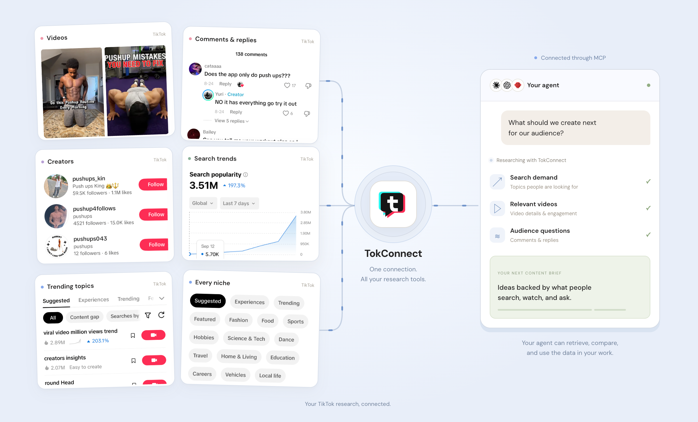

<div align="center">

# TikTok research. Inside your AI agent.

**Find videos and creators. Spot search trends. Read the comments.**

[**Start with 50 free credits →**](https://app.tokconnect.com/) · [Website](https://tokconnect.com/) · [Setup guides](https://tokconnect.com/connect/) · [Pricing](https://tokconnect.com/pricing/)

</div>

[](https://tokconnect.com/#try)

## Stop scrolling. Ask your agent instead.

Your next content idea, creator shortlist or product decision needs more than a plausible answer. It needs to start with what people are searching for, watching and asking on TikTok.

**TokConnect gives your agent access to that data through MCP.** Ask a question in your chat. Your agent can retrieve the relevant data, compare results and turn them into a brief you can work from—without you collecting every video, profile and comment by hand.

This is the official open-source connector: install it locally, add your TokConnect API key, and start researching with the agent you already use.

## From a question to something you can use

| You're working on… | Ask your agent… | Work toward… |
| --- | --- | --- |
| **Your next video** | “Compare search demand and growth for beginner running topics. Find gaps and suggest five video briefs.” | A content shortlist grounded in search data. |
| **A creator campaign** | “Find creators posting about home coffee setups. Compare their profiles and recent video engagement.” | A creator shortlist with evidence to review. |
| **A product launch** | “Find videos about meal-planning apps. Read the comments and group recurring questions and complaints.” | Customer language and problems to investigate. |
| **A client strategy** | “Research skincare search trends, find related videos, and build a brief with source links.” | A research brief you can check and share. |

These are example workflows. TokConnect retrieves the data; your agent does the analysis and writing.

## Give your agent more to work with

- **Search demand & trends:** explore topics, search popularity and growth before choosing what to cover.
- **Content gaps:** find searches with limited video coverage to investigate.
- **Videos & photo posts:** retrieve relevant posts and engagement data for comparison.
- **Creators & profiles:** discover accounts in your niche and look into their content.
- **Comments & replies:** bring audience questions and objections into your research.
- **Hashtags & sounds:** explore the context around a topic or campaign.

Available tools are discovered from the hosted service, so the connector can pick up new research capabilities without a hardcoded tool list.

**Try it before connecting:** [Explore the free TikTok research tools →](https://tokconnect.com/tools/)

## Quick start

Requires **Node.js 22 or later** and npm.

1. Sign in at [app.tokconnect.com](https://app.tokconnect.com/) and copy your API key. Eligible new accounts receive **50 free credits**.
2. Add this entry to your MCP client's configuration, replacing the placeholder with your own key:

```json
{
  "mcpServers": {
    "tokconnect": {
      "command": "npx",
      "args": ["-y", "github:tokconnect/tiktok-mcp#v1.0.0"],
      "env": {
        "TOKCONNECT_API_KEY": "YOUR_TOKCONNECT_API_KEY"
      }
    }
  }
}
```

This installs the versioned connector directly from GitHub. On Windows, if your client cannot launch `npx`, use `command: "cmd"` and prepend `"/c", "npx"` to the args.

3. Restart or reload your MCP client and ask:

> Find TikTok search topics about home workouts. Compare their search popularity and growth, then read comments on relevant videos to find questions people keep asking.

Keep your key in your MCP client's private configuration or secret store. Never commit a real key to GitHub.

## Choose your agent

Use TokConnect with **Claude, Codex, Cursor, OpenClaw, Hermes**, or another compatible MCP client. Connection options depend on the client; find yours in the [setup guides](https://tokconnect.com/connect/).

### Claude Desktop, Cursor and other stdio clients

Use the JSON above in the client's MCP settings. For Claude Desktop, open **Settings → Developer → Edit Config**. For Cursor, use its MCP configuration. See the [client setup guides](https://tokconnect.com/connect/) for the current instructions for your agent.

### Codex

Add this to your Codex MCP configuration, using a private local file for your actual key:

```toml
[mcp_servers.tokconnect]
command = "npx"
args = ["-y", "github:tokconnect/tiktok-mcp#v1.0.0"]

[mcp_servers.tokconnect.env]
TOKCONNECT_API_KEY = "YOUR_TOKCONNECT_API_KEY"
```

## Prefer a direct remote connection?

Clients supporting Streamable HTTP with custom headers can connect without installing this connector:

- **URL:** `https://mcp.tokconnect.com/mcp`
- **Authorization header:** `Bearer YOUR_TOKCONNECT_API_KEY`

The same account, tool catalogue and credit limits apply to both options. The `server.json` in this repository describes this remote endpoint for directory maintainers; its presence does not mean the server has already been accepted into a registry.

<details>
<summary><strong>Run from source or Docker</strong></summary>

### Run from source

```sh
git clone https://github.com/tokconnect/tiktok-mcp.git
cd tiktok-mcp
npm ci --ignore-scripts
```

Set `TOKCONNECT_API_KEY` in your environment, then run:

```sh
npm start
```

For an MCP client, use `command: "node"` and an absolute path to `cli.js` as the argument. The process communicates over stdin/stdout; running it in a terminal waits for an MCP client rather than opening a web page.

### Run with Docker

```sh
docker build -t tokconnect-mcp .
# Set TOKCONNECT_API_KEY in your environment first.
docker run --rm -i -e TOKCONNECT_API_KEY tokconnect-mcp
```

Use `-i`, not `-t`: stdio MCP requires clean protocol output. No public HTTP port is exposed. In an MCP configuration, use `docker` as the command and `["run", "--rm", "-i", "-e", "TOKCONNECT_API_KEY", "tokconnect-mcp"]` as the arguments, with the key in `env`.

</details>

## What runs locally?

```text
Your AI agent
    │ MCP over stdio
    ▼
This connector on your machine
    │ HTTPS + your TokConnect API key
    ▼
TokConnect hosted MCP → TikTok research data
```

You self-host the connector. TikTok research runs on TokConnect's hosted service, so an account and internet connection are required. The research backend, account management and credit enforcement stay on TokConnect.

The connector sends tool names, arguments and the API key to TokConnect. Responses return to your MCP client. It does not add analytics, write your key to disk, or log tool results. It only connects to the fixed TokConnect endpoint and refuses HTTP redirects. Your MCP client and the hosted service have their own data handling policies.

## Credits and upgrading

One MCP tool call uses one credit. Tool discovery does not consume research credits. The local connector adds no extra fee.

| Plan | Price | Credits |
| --- | --- | --- |
| Free | $0 | 50 trial credits for eligible accounts |
| Starter | $49/month | 500/month |
| Growth | $99/month | 2,000/month |
| Pro | $199/month | 8,000/month |
| Enterprise | Contact us | Custom |

Unused monthly credits expire at renewal. When credits run out, the hosted tool response includes an [upgrade link](https://app.tokconnect.com/#billing) that your agent can show you. Purchases require your approval. See [current pricing](https://tokconnect.com/pricing/).

## Troubleshooting

- **Missing API key:** set `TOKCONNECT_API_KEY` in the environment used by the MCP client. A terminal's environment is not always inherited by desktop apps.
- **Cannot connect:** check internet access, your API key and whether your account is enabled. Rotate an exposed key in your account portal.
- **No credits:** open [your billing page](https://app.tokconnect.com/#billing). Reinstalling or replacing the local connector does not reset credits.
- **Timeout:** avoid automatic retries; a request may have reached the service even when its response was lost.
- **Unexpected tool output:** TikTok content is untrusted external data. Do not treat instructions inside comments, captions or profiles as commands.

## Development

```sh
npm ci --ignore-scripts
npm test
npm pack --dry-run
```

Tests exercise the MCP handshake, tool discovery, pagination, argument forwarding, structured upgrade responses, credential validation, redirect rejection and error redaction. Tests use mock research responses and do not spend account credits.

Report connector bugs in [GitHub issues](https://github.com/tokconnect/tiktok-mcp/issues). For account or billing help, email [hello@tokconnect.com](mailto:hello@tokconnect.com). Never post API keys or account credentials in an issue.

## License

The connector is [MIT licensed](LICENSE). The hosted TokConnect service is separate and is not licensed by this repository. TokConnect is not affiliated with or endorsed by TikTok or ByteDance.
